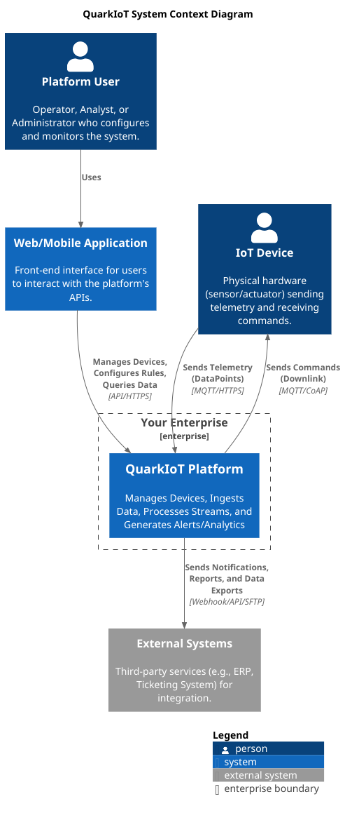
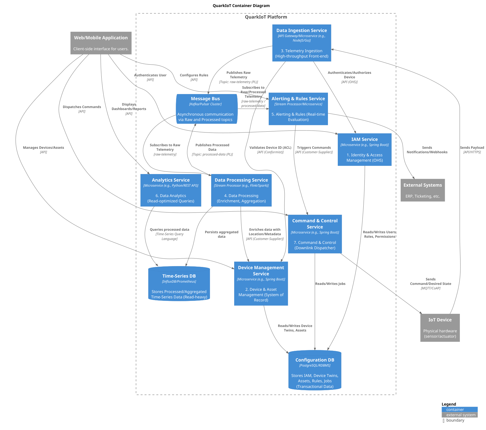
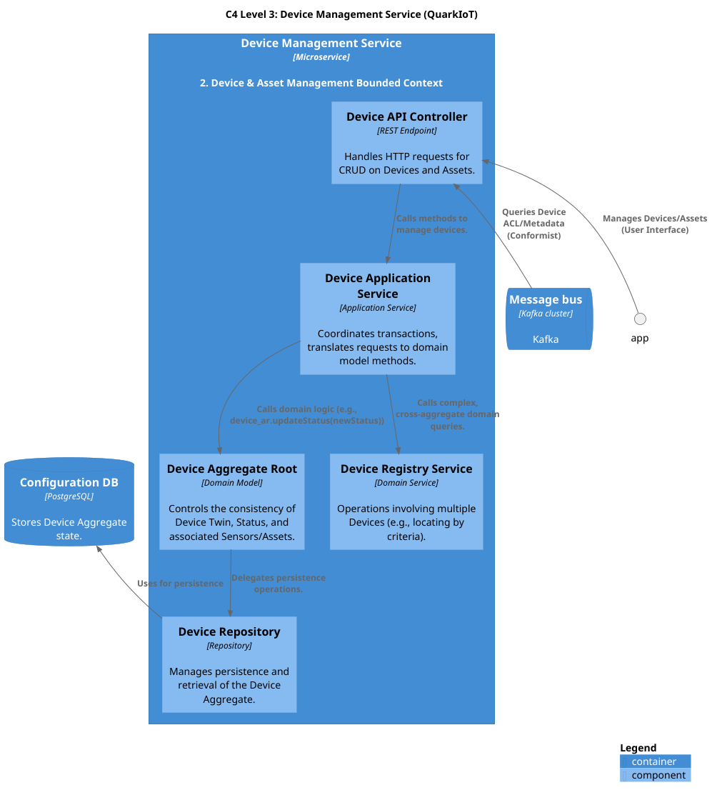
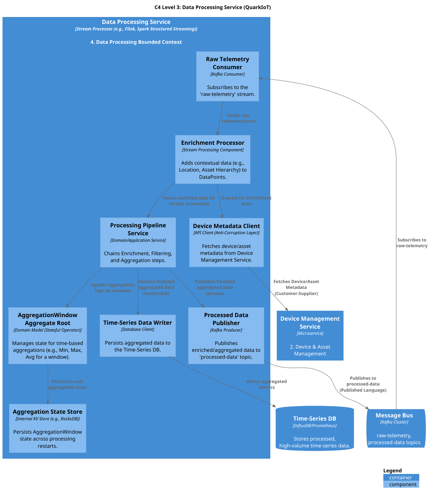
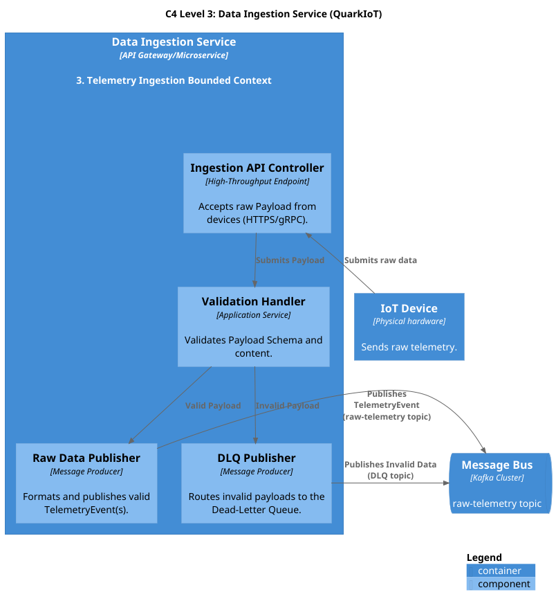
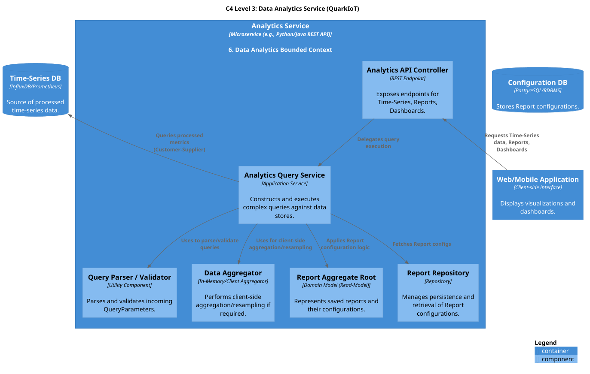

# IoT-Device-Overseer - Microservices platform collecting and analyzing data from IoT devices/sensors

This is a team project (team of three students) for the course Service Oriented Architecture (PV217) at the Faculty of Informatics, Masaryk University. In this project, i was responsible for processing service and setting up communication between services using Kafka.

## Official description

The goal of this project is to design and implement a distributed microservices-based platform using Quarkus for collecting, storing, and analyzing data from IoT devices and sensors.
The system should be able to receive real-time data streams (e.g., temperature, humidity, light intensity, motion, etc.) from a set of IoT devices, process and persist the data efficiently to keep historical data, and expose REST APIs for data access, analytics, and visualization. Example of sample services that can be part of the system

### Device Management Service
Registers and manages IoT devices (e.g., device ID, type, location).
### Data Ingestion Service
Collects incoming sensor data, validates against device management service if sensor is registered, sends data to be processed by different service.
### Data Processing Service
Subscribes to event streams of incoming data, enriches the data with metadata from device management service, evaluates whether measurements are within healthy range, sends result data to analytics service.
### Analytics Service/Reporting Service
Subscribes to processed data event stream. Persists the data and exposes REST APIs for data access, analytics, and visualization.

## Scenario of use

### Predictive Maintenance in Manufacturing
Unplanned downtime of factory machinery is extremely expensive, causing production delays and high repair costs. The goal is to predict failures before they happen.
#### Examples of sensors used
- Vibration Sensors: Attached to motors, pumps, and conveyor belts to detect unusual vibrations.
- Thermal Cameras/Sensors: Monitor machine temperatures for signs of overheating.
- Acoustic Sensors: Listen for changes in sound patterns that indicate wear and tear.
- Power Consumption Meters: Track energy usage spikes that can precede a failure.
#### Example of service use
- Data Ingestion Service: Handles high-frequency data streams from sensors.
- Data Processing Service: Detects anomalies in measured values. Can integrate with machine learning models for advanced predictions.
- Analytics Service: Provides real-time dashboards for operators to monitor machine health.
- Device Management Service: Registers sensors and machines, provides metadata for processing, updates rules for anomaly detection.
#### Business Value
- Reduced Downtime: Prevents catastrophic failures, increasing production uptime.
- Lower Maintenance Costs: Shifts from reactive (fix when broken) to proactive (fix before it breaks) maintenance.
- Improved Safety: Identifies potentially dangerous equipment failures in advance.

## Why microservices architecture?
A microservice architecture is strategically advantageous for this predictive maintenance platform. In a dynamic manufacturing environment with numerous production lines, each generating high-frequency data from a diverse set of sensors, the system must be highly scalable, resilient, and adaptable. Microservices directly address these requirements in ways a traditional monolithic application cannot.
### Pros
*   **Independent Scalability & Cost Optimization**
    *   **Problem:** Not all parts of the system have the same workload. The `Data Ingestion Service` might handle millions of messages per minute from vibration sensors, while the `Reporting Service` is used only a few times an hour.
    *   **Advantage:** We can scale the `Data Ingestion Service` across a large cluster of containers while running only a single instance of the `Reporting Service`. This targeted scaling optimizes resource usage and cloud infrastructure costs significantly, which would be impossible in a monolith where the entire application must be scaled together.

*   **Resilience and Fault Isolation**
    *   **Problem:** Manufacturing operations cannot tolerate system-wide failures. Downtime is extremely costly.
    *   **Advantage:** If a new, complex machine learning algorithm causes the `Data Processing Service` to crash, the `Data Ingestion` and `Analytics` services remain fully operational. The system will continue collecting new data and displaying the last known machine state on dashboards, preventing a total monitoring blackout and ensuring business continuity.

*   **Technology Heterogeneity (Right Tool for the Job)**
    *   **Problem:** Different tasks require different technological solutions for optimal performance and productivity.
    *   **Advantage:** This architecture allows us to use the best tool for each job. We can use **Quarkus (Java)** for the high-throughput `Data Ingestion Service` and potentially **Python with TensorFlow** for the `Data Processing Service`, where data scientists are most productive in building and deploying machine learning models.

*   **Faster, Independent Deployments**
    *   **Problem:** The factory floor is dynamic. New prediction models need to be deployed quickly without risking the stability of the entire platform.
    *   **Advantage:** Each service, focused on a single business capability (e.g., ingestion, anomaly detection), can be developed, tested, and deployed independently. When the data science team improves a prediction model, they can roll out a new version of the `Data Processing Service` in minutes, without requiring a full-scale, risky deployment of the entire platform.

### Cons
*   **Operational Complexity**
    *   **Challenge:** Managing a fleet of services is inherently more complex than a single application.
    *   **Implication:** This necessitates a mature DevOps culture and robust tooling for container orchestration (e.g., Kubernetes), centralized logging (e.g., ELK Stack), and distributed monitoring (e.g., Prometheus, Grafana).

*   **Data Consistency Across Services**
    *   **Challenge:** Ensuring data integrity across multiple services and their dedicated databases is difficult. A simple ACID transaction is no longer possible.
    *   **Implication:** Guaranteeing that a detected anomaly both triggers an alert and is logged for historical analysis requires advanced patterns like **event sourcing** or the **Saga pattern** to achieve eventual consistency.

*   **Network Latency and Resiliency**
    *   **Challenge:** Communication between services occurs over the network, which introduces latency and is less reliable than in-process function calls.
    *   **Implication:** Every service must be designed with resiliency patterns like **retries, timeouts, and circuit breakers** to handle transient network issues or the temporary unavailability of a downstream service.

## Domain driven design
### Strategic design
#### Bounded context
Here is a more detailed extension of the **Ubiquitous Language** for each Bounded Context.

---

#### 1. Identity & Access Management (IAM)
This context is a "gatekeeper," focused exclusively on *who* can do *what*. The language is technical and precise, centered on security and identity.

* **User:** A human actor who logs in.
* **Device:** IoT device with sensors
* **Entity:** a `User` or a `Device`, used for auth.
* **Tenant:** A group of `Entities` - `Users` and `Devices` sharing a common account (e.g., "Customer-ABC-Corp"). This ensures data is isolated.
* **Identity:** The unique identifier for a `Entity` (e.g., username, device serial number).
* **Token:** A time-limited, verifiable credential (e.g., JWT) that *proves* a `Entity` has been authenticated.
* **Role:** A collection of `Permissions` (e.g., "Admin," "Viewer," "Operator").
* **Permission:** A granular right to perform a specific action (e.g., `device:create`, `data:read`).
* **Scope:** A specific area of access a `Token` is valid for (e.g., "read-telemetry").
* **Verbs:** `authenticate`, `authorize`, `grant`, `revoke`, `validate`.

---

#### 2. Device & Asset Management
This context is the "system of record" or "inventory" for physical things. The language is about cataloging, organizing, and describing these "digital twins."

* **Device:** The digital representation of a physical piece of hardware (e.g., "Temperature-Sensor-XT100").
* **Facility Twin:** A JSON document representing the *full state* of a device, including its `desiredState` (what we *want* it to be) and `reportedState` (what it *says* it is).
* **Sensor:** A component of a `Device` that produces a specific type of data (e.g., "humidity-reader").
* **Asset:** A logical or business-level item that a `Device` is attached to (e.g., "Shipping-Container-42" or "Factory-Floor-1").
* **Asset Hierarchy:** The logical grouping of `Assets` (e.g., "Building-A" contains "Floor-1" which contains "Room-101").
* **GPS Location:** The physical coordinates (`latitude`, `longitude`) or logical position (`Building-A`) of a `Device` or `Asset`. (for moving objects)
* **Status:** The operational state of the device (e.g., `provisioned`, `online`, `offline`, `maintenance`).
* **Metadata:** Key-value pairs describing the device (e.g., `{"installDate": "...", "firmwareVersion": "..."}`).
* **Verbs:** `register`, `provision`, `commission`, `decommission`, `attach`, `locate`, `group`.

---

#### 3. Telemetry Ingestion
This context is the high-speed "front door" for data. The language is all about throughput, validation, and routing, not what the data *means*.

* **DataPoint:** A single sensor reading, consisting of a value and a timestamp (e.g., `{"temp": 23.5, "ts": 1678886400}`).
* **Payload:** The raw batch of data sent by a device.
* **IngestionStream:** The logical "pipe" where data is published (e.g., a Kafka topic like `raw-telemetry-stream`).
* **Schema:** The expected structure of an incoming `Payload` (according to type of data sensor is "producing").
* **Dead-Letter Queue (DLQ):** A separate "holding pen" for data that fails `validation` (e.g., bad schema, unknown `deviceId`).
* **Verbs:** `ingest`, `receive`, `validate`, `publish`, `broadcast`, `throttle`, `reject`.

---

#### 4. Data Processing
This context is the "factory" that transforms raw, messy data into clean, valuable information. The language is about rules, transformations, and time.

* **Pipeline:** A series of steps a `DataPoint` goes through (e.g., `Enrich` -> `Filter` -> `Aggregate`).
* **Enrichment:** The act of adding contextual data (e.g., adding `Location` from Device Management to a `DataPoint`).
* **Filtering:** Dropping irrelevant or invalid data (e.g., "discard readings where temp < 0").
* **Aggregation:** Summarizing data over a `Window` (e.g., calculating the "5-minute average").
* **Window:** A specific slice of time.
    * **Tumbling Window:** A fixed, non-overlapping time slice (e.g., 1:00-1:05, 1:05-1:10).
    * **Sliding Window:** An overlapping time slice (e.g., 1:00-1:05, 1:01-1:06).
* **Watermark:** A marker that indicates how "up-to-date" the stream processing is, used to know when a `Window` can be closed and finalized.
* **Verbs:** `process`, `transform`, `normalize`, `enrich`, `aggregate`, `filter`, `compute`.

---

#### 5. Alerting & Rules
This context is the "watchtower" that actively monitors the data. The language is about states, triggers, and consequences.

* **Rule:** A user-defined expression that is `evaluated` against data (e.g., `device.temp > 40`).
* **Condition:** A specific part of a `Rule` (e.g., `device.temp > 40`) and how long it must be true (e.g., `for: 5_minutes`).
* **Threshold:** The specific value in a `Condition` (e.g., `40`).
* **Alert:** An event created when a `Rule`'s `Condition` is met.
* **State:** The lifecycle of an `Alert` (`pending`, `firing`, `resolved`).
* **Severity:** The importance of the `Alert` (e.g., `info`, `warning`, `critical`).
* **Notification:** The *action* taken when an `Alert` changes `State` (e.g., send an email, call a webhook).
* **Silence:** A temporary, user-created mute on a `Rule` or `Alert`.
* **Verbs:** `evaluate`, `trigger`, `fire`, `resolve`, `notify`, `escalate`, `silence`.

---

#### 6. Data Analytics
This context is the "library" that serves historical data. The language is about querying and presenting read-only information, optimized for fast reads.

* **Time-Series:** A sequence of data points indexed in time order (the primary data type).
* **Metric:** The specific *thing* being measured (e.g., `temperature`, `cpu_usage`).
* **Dimension:** The `Metadata` used to "slice" a `Metric` (e.g., query `temperature` *by* `location` and `device_type`).
* **Granularity:** The time interval for summarized data (e.g., `raw`, `hourly_average`, `daily_max`).
* **Query:** A specific request for data (e.g., "Get the `hourly_average` `temperature` for all devices in `Building-A`").
* **Report:** A saved `Query` that can be run on demand and `exported`.
* **Dashboard:** A collection of `Visualizations` (charts, graphs) that display the results of multiple `Queries`.
* **Data Model:** The "read-optimized" schema of the analytics database (e.g., a star schema).
* **Verbs:** `query`, `visualize`, `export`, `generate`, `present`, `slice`, `dice`.

---

#### 7. Command & Control (C&C)
This context is the "control panel" for sending messages *back* to devices. The language is about actions, delivery, and confirmation.

* **Command:** A one-way message sent to a device (e.g., `{"reboot": true}`).
* **Job:** A `Command` that needs to be sent to *many* devices, with tracking for success/failure on each.
* **Downlink:** The communication channel *to* the device (as opposed to "uplink" *from* the device).
* **Acknowledgement (Ack):** A confirmation message from the device that it *received* the `Command`.
* **Command Status:** The state of the `Command` (`queued`, `sent`, `delivered`, `acked`, `failed`, `timeout`).
* **Desired State:** A persistent `Command` (part of the `Device Twin`) that tells the device what its configuration *should* be (e.g., `{"updateInterval": "5m"}`). The device is responsible for eventually matching this state.
* **Verbs:** `dispatch`, `send`, `queue`, `acknowledge`, `schedule` (a `Job`).


#### Context map: U/D Relationships
**Identity & Access Management (U) ➔ All Contexts (D)**
* **Relationship:** **Open Host Service (OHS)**.
* **Description:** IAM provides a public API (like OAuth 2.0 / JWT) that all other services use to authenticate and authorize requests. IAM is the authority on *who* a user is.

* **Device & Asset Management (U) ➔ Telemetry Ingestion (D)**
    * **Relationship:** **Conformist (C)**.
    * **Description:** The Ingestion service *must* know if a device is allowed to send data. It **conforms** to the model from the Device Management context. It uses an **Anti-Corruption Layer (ACL)** to protect itself by translating the `Device` model into a simple "allow list" it can check quickly.

* **Device & Asset Management (U) ➔ Data Processing (D)**
    * **Relationship:** **Customer-Supplier (CS)**.
    * **Description:** The Processing service (Customer) needs device metadata (e.g., location, type) to *enrich* the raw data. The Device Management team (Supplier) provides this data via an API.

* **Telemetry Ingestion (U) ➔ Data Processing (D) & Alerting (D)**
    * **Relationship:** **Published Language (PL)**.
    * **Description:** The Ingestion service *publishes* raw data events (e.g., to a Kafka topic) in a well-defined format. Both the Processing and Alerting contexts are *subscribers* to this data stream.

* **Data Processing (U) ➔ Data Analytics (D)**
    * **Relationship:** **Customer-Supplier (CS)**.
    * **Description:** The Processing service (Supplier) creates and stores the aggregated, clean data. The Analytics service (Customer) is the primary consumer of this data for reports and dashboards.

* **Alerting & Rules (U) ➔ Command & Control (D)**
    * **Relationship:** **Customer-Supplier (CS)**.
    * **Description:** When a rule triggers an *action* (e.g., "temp too high, shut down"), the Alerting context (Customer) requests that the C&C context (Supplier) send the appropriate command.


### Tactical design
#### 1. Bounded Context: Device & Asset Management
* **Purpose:** Manages the registry and metadata of all physical devices.
* **Identified Microservice(s):** `device-management-service`
* **Key Aggregates & Services:**
    * **`Device` (Aggregate Root):** This is the core a. It controls its own state.
        * **Root:** `Device` (e.g., `deviceId`, `name`, `status`)
        * **Entities:** `Sensor` (e.g., `sensorId`, `type`, `unit`)
        * **Value Objects:** `Location` (`latitude`, `longitude`), `DeviceMetadata` (key-value pairs)
    * **`DeviceRegistry` (Domain Service):** A service for operations that don't fit on a single `Device`, e.g., "Find all devices in a location."


---

#### 2. Bounded Context: Telemetry Ingestion
* **Purpose:** Provides a high-throughput endpoint for devices to send data.
* **Identified Microservice(s):** `data-ingestion-service`
* **Key Aggregates & Services:**
    * **Note:** This context is often "aggregateless." Its primary job is to validate, format, and publish events.
    * **`TelemetryEvent` (Value Object):** The primary data structure (e.g., `deviceId`, `timestamp`, `readings`).
    * **`IngestionHandler` (Application Service):**
        1.  Receives a batch of `TelemetryEvent`s.
        2.  Validates `deviceId` against its ACL (from Device Management).
        3.  Publishes valid events to the "raw-data" message stream (e.g., Kafka).

---

#### 3. Bounded Context: Data Processing
* **Purpose:** Subscribes to raw data, transforms it, and stores it for analysis.
* **Identified Microservice(s):** `data-processing-service`
* **Key Aggregates & Services:**
    * **`AggregationWindow` (Aggregate Root):** (For creating time-series data)
        * **Root:** `AggregationWindow` (e.g., `sensorId`, `windowStartTime`, `windowType`)
        * **State:** `currentAvg`, `currentMin`, `currentMax`, `count`
        * **Methods:** `addReading(value)`, `finalizeWindow()`
    * **`ProcessingPipeline` (Domain Service):** An application service that chains operations:
        1.  *Subscribes* to the "raw-data" stream.
        2.  *Enriches* data (using data from Device Management).
        3.  *Aggregates* data (using `AggregationWindow`).
        4.  *Persists* the result to the "processed-data" store.

---

#### 4. Bounded Context: Data Analytics
* **Purpose:** Provides REST APIs to query and visualize processed data.
* **Identified Microservice(s):** `analytics-service`, `reporting-service`
* **Key Aggregates & Services:**
    * **Note:** This is a "read-heavy" context, often implemented using a CQRS pattern. The "Aggregates" are really just read-models.
    * **`Report` (Aggregate Root):**
        * **Root:** `Report` (e.g., `reportId`, `name`, `config`)
        * **Value Objects:** `QueryParameters` (`deviceIds`, `timeRange`, `granularity`)
    * **`AnalyticsQueryService` (Application Service):**
        * Exposes endpoints like `GET /api/analytics/timeseries` and `GET /api/reports/{id}`.
        * Constructs and runs queries against the "processed-data" store.

## Design of services
### C4 Level 1 (Context)

### C4 Level 2 (Container)

### C4 Level 3
#### Device management service

#### Data processing service

#### Data ingestion service

#### Data analytics service


## Technology stack

**Programming language:** Java 21    
**Framework:** Quarkus 3.29.1   
**Message broker:** Kafka 4.1.1   
**Database:** PostgreSQL 16   
**Cache:** Redis 7   
**Monitoring:** Prometheus 3.0.0, Grafana 9.5.7    
**Containerization:** Docker 28.5.0, Docker Compose 2.40.3    
**Other:** locust 2.42.6, adminer, Kafka UI

## How to run
### 1. Clone the Repository

```bash
git clone <repository-url>
cd quarkiot
```
### 2. Set Up Environment Variables

Copy the example environment file and configure it:

```bash
cp .envexample .env
```

### 3. Run the Application

Use the provided startup script:

```bash
sudo ./scripts/start.sh
```

This script will:
1. Build all services using Maven
2. Build Docker images
3. Start all containers with Docker Compose

## Accessing Services

- **Ingestion Service:** http://localhost:8082/q/swagger-ui
- **Device Management:** http://localhost:8081/q/swagger-ui
- **Processing Service:** http://localhost:8083/q/swagger-ui
- **Analytics Service:** http://localhost:8084/q/swagger-ui
- **Adminer (DB UI):** http://localhost:8080
- **Kafka UI:** http://localhost:8085
- **Grafana:** http://localhost:3000
- **Prometheus:** http://localhost:9090

